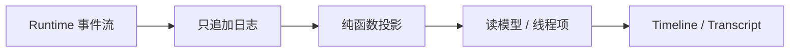
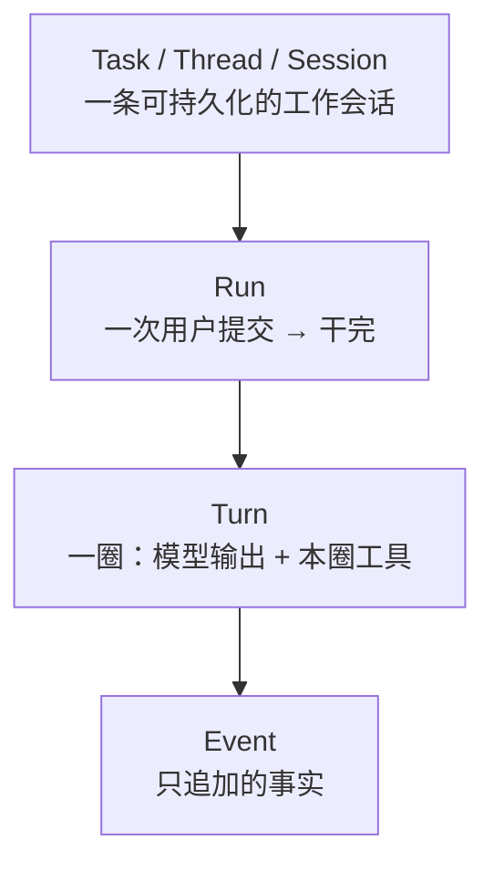
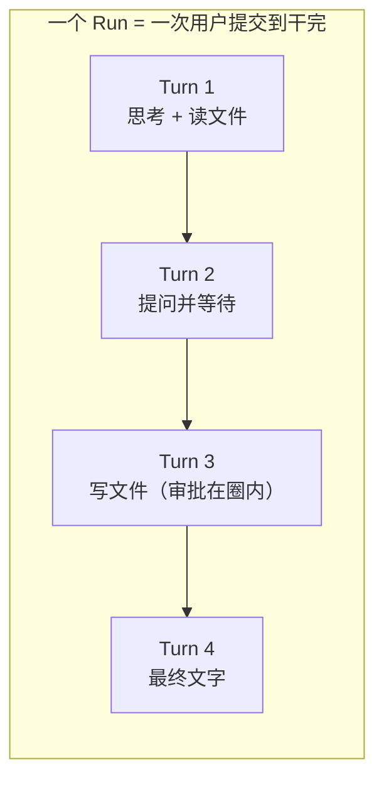
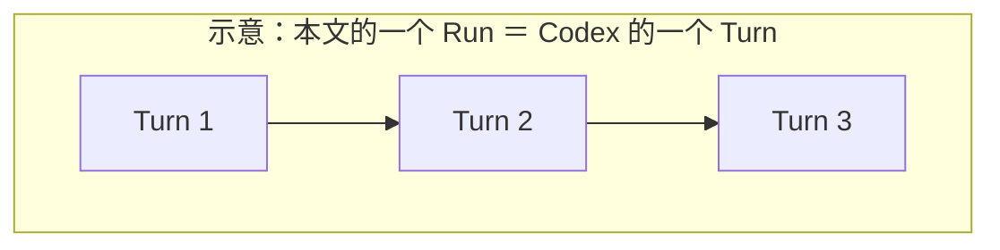
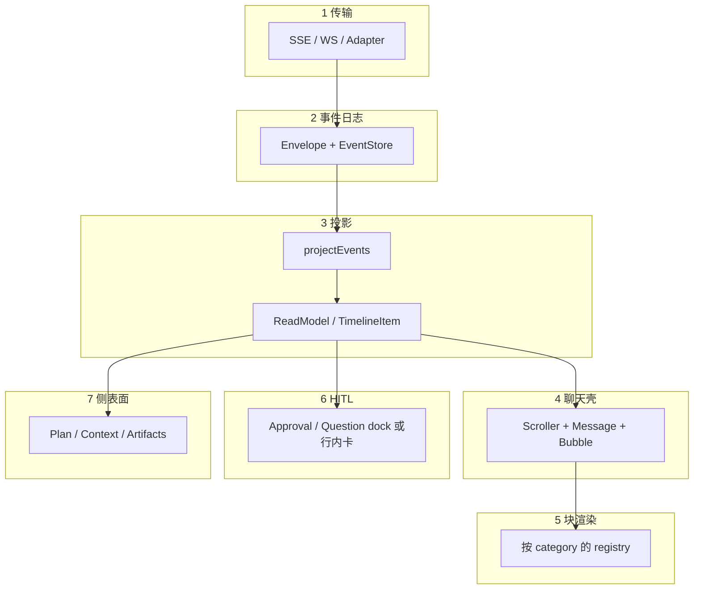
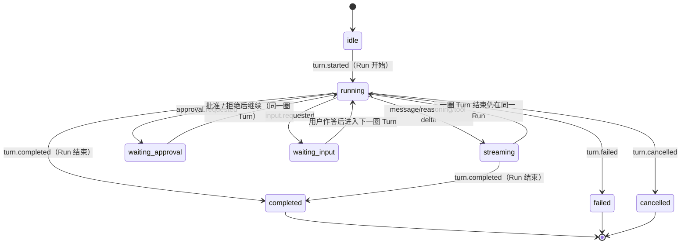
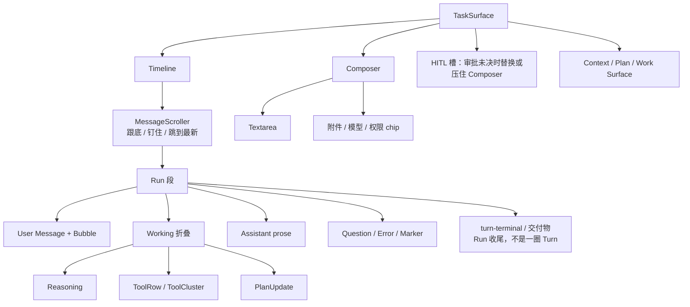
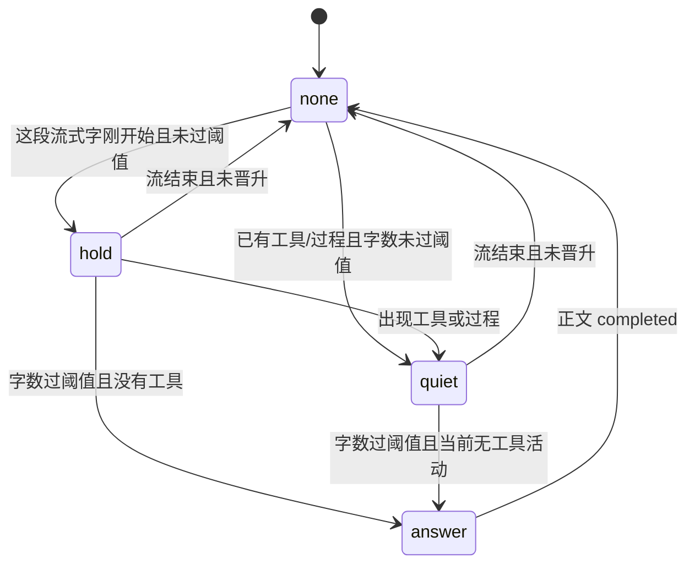
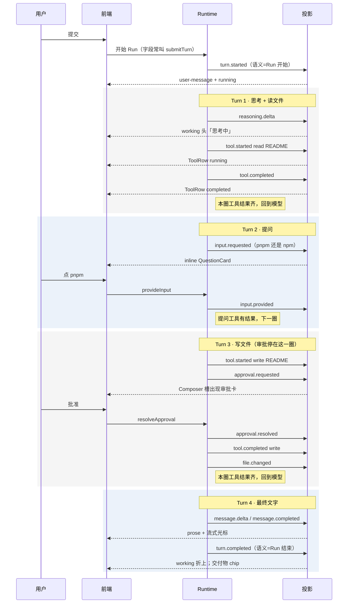

# Agent 事件流与前端投影

给要改对话事件流、投影或 Timeline 的人（含后续 AI）用的做法说明。也可以当独立知识库读、拿去分享。

行业对照只记方案与取舍；食谱不绑某一仓库路径。**读本文不需要先读任何决策记录或术语表。** 原则、用词和改法都写在正文里。

## 本文自含的原则

后面章节默认这五条。它们是做法，不是外链作业。

1. **Runtime 不进 Renderer。** Agent 执行引擎在后端或本机侧车。前端只发 Command、收信封。UI 进程里不要跑模型循环，也不要解析 provider 私有 chunk。
2. **事件是只追加的事实，UI 只画投影。** `(state, event) => state`。重进任务 = 重放，不是接着上次 React state。权威不在组件里，前端也不必自建完整 Event Sourcing。
3. **身份是 Task > Run > Turn > Event。** Run = 一次用户提交到干完；Turn = 一圈模型输出 + 本圈工具。详见 §2.1。
4. **事件族用动词三段式**（`started` → `delta` / `progress` → `completed`），不要万能的 `item.updated`。词表以 §4 为准。
5. **层不能塌。** 传输、日志、投影、聊天壳、块、HITL、侧表面分开。库可以补其中几层，不能让一个 Timeline 文件包办。

概念名和协议字段名经常不一致（例如信封写 `turnId`，语义却是一次提交）。本文一律按**语义**说话；读实现时看字段实际圈住的生命周期，不要望文生义。

## 改什么读哪一章

| 你要做的事 | 读 |
|---|---|
| 先对齐原则和用词 | 文首原则 + §2.1 |
| 理解为什么不能直接画 messages | §1–§2 |
| 给新 Runtime / 新事件族定位该落哪一层 | §3–§4 |
| 改折叠、跟底、气泡、工具行 | §6 + §8 案例 |
| 接审批 / 提问 | §6.5 + §8 |
| 新增事件或新增一种块 | §5 + §10 |
| 对标主流方案 | §9 |
| 流式合帧、节流、晋升门 | §6.3 + §6.6 |
| 动效 / 呈现词汇（扫光、时间轴等） | §6.7 |
| 对照真实产品 GIF 走读 | §8.4 |

---

## 1. 问题：为什么不能直接画 messages

Chat 产品可以把 `[{ role, content }]` 画成左右气泡。Agent 工作台不行，因为一轮 Run 里同时发生：

- 流式正文和流式思考
- 多次工具调用（开始 / 进度 / 结果）
- 人机停顿（审批、提问、选目录）
- 文件变更、计划步骤、警告
- 取消、失败、重试、断线后重放

若把 SSE / WS 的 chunk 直接 `setState` 进组件：

- 刷新或重进任务无法重放
- 工具结果和正文抢同一条消息
- 审批卡会变成「一条已完成的助手气泡」
- 无法区分「过程旁白」和「最终答案」

主流做法是 **只追加事件，再用纯函数投影成读模型，UI 只渲染读模型**。



OpenAI Chat Completions 的 `messages` 适合当 **持久化互通格式**，不适合当 **直播 UI 状态**。直播用细粒度事件；回放时再把 messages fold 成同一套读模型。

---

## 2. 概念模型

### 2.1 四层身份



**Turn 是一次循环，不是一次用户提交。** 这是 Agent 内核里的多数用法（Claude Agent SDK、OpenAI Agents SDK），不是为了对齐 Codex。

| 词 | 是什么 | 不是什么 |
|---|---|---|
| **Task** | Navigator 里的一条会话，里面可以有很多个 Run | 一次发送 |
| **Run** | **一次用户提交**，到 Agent 针对这次提交把活干完（完成 / 失败 / 取消） | 一圈模型调用、一条气泡 |
| **Turn** | Run **里面** 的一圈：模型输出 + 本圈工具，然后可能再回到模型 | 一次用户提交；Codex 产品里的 Turn |
| **Plan Step** | 计划清单上的一行（待做 / 进行中 / 完成） | Turn；中文「步骤」留给 Plan |

一次 Run 里通常有 **0 到多圈** Turn。用户说「看看 README，不确定就先问我」，Agent 可能走出下面四圈。这整段是 **一个 Run、四圈 Turn**（与 §8 同一案例）。用户再发一句，才是下一个 Run。

审批、提问停在 **当前 Run** 里。用户作答或批准 **本身不是新 Turn**，也不是新 Run；模型拿到结果后再开口，才是下一圈。



**概念名和协议字段经常对不齐。** 不少实现（含 Codex 风格协议）把一次用户提交的信封写成 `turnId` / `turn.started` / `turn.completed` / `turnStatus`。口头和本文按 **Run** 理解这些标识；它们圈的是一次提交，**不是** 一圈 Turn。概念层的 Turn 常常没有独立事件，由该 Run 内的 `message` / `reasoning` / `tool` 序列构成。协议里若出现 `Step`，接近一圈 Turn，**不要**和 Plan Step 混称「步骤」。改字段名是实现细节，本文不依赖某一次改名。

#### 业界同一词三用（我们跟 Agent 内核多数）

| 用法 | 边界 | 谁这么说 | 我们叫它 |
|---|---|---|---|
| **循环里的一圈** | 一次模型输出 + 其工具执行 | **Claude Agent SDK**（Each full cycle is one turn）、**OpenAI Agents SDK**（`max_turns` = one AI invocation） | **Turn** |
| **用户请求** | 用户点一次发送 → Agent 把这件差事做完 | **Codex App Server**（他们把这叫 Turn）、Codex 博文（one turn 可含 many iterations） | **Run** |
| **说话轮换** | 用户说一句 / 助手说一句 | 经典对话、Grok / Chat Completions 的 multi-turn | 用户气泡 / 助手气泡，不要叫 Turn 或 Run |

OpenAI 自己也不统一：Agents SDK 的 turn = 一圈；Codex 产品的 Turn = 一次提交（= 我们的 Run）。读 Codex 文档时写成「Codex 的 Turn（= 我们的 Run）」。



上图只说明「Codex 的一个 Turn 里可以有多圈」，圈数是示意，不是 §8 的四圈案例。

**本文用语：** Turn = 一圈循环；Run = 一次用户提交。提到 Codex 时写成「Codex 的 Turn（= 本文的 Run）」，不要对译成本文的 Turn。

| 本教程用词 | Codex App Server | Claude Agent SDK | OpenAI Agents SDK |
|---|---|---|---|
| Task | Thread | Session | conversation / session |
| Run | **他们的 Turn** | 一次 `query()` → `ResultMessage` | `Runner.run` |
| Turn | inference + tool cycle | **他们的 turn** | **他们的 `max_turns` 一格** |
| TimelineItem | ThreadItem | AssistantMessage / tool 块 | item |

### 2.2 三份模型，不要混

| 模型 | 谁写 | 谁读 | 职责 |
|---|---|---|---|
| **传输事件** | Runtime / Adapter | 投影 | 细粒度、可重放、与 UI 无关 |
| **持久化消息**（可选） | 后端 | 回放投影 | 常做成 OpenAI `messages`，便于换 provider |
| **读模型 / 线程项** | 投影（纯函数） | UI | 已经按「这一行怎么画」分好类 |

UI 禁止解析 provider 私有 chunk。Adapter 把私有流译成信封；投影只认信封。

### 2.3 信封最小字段

一次可投影的事件至少要有：

- `schemaVersion`
- `eventId`（幂等）
- `taskId` / `turnId`（`turnId` 归属当前 **Run**，不是一圈 Turn）
- `type`（见 §4）
- `occurredAt`
- `payload`（该族自己的形状）

未知 `type` 必须变成 `unsupported-event`，不能丢、不能崩。

---

## 3. 七层管线

Agent 前端不是「一个 Chat 组件」。Codex、Claude Code、ChatGPT 一类工作台都拆成下面七层。可以自研，也可以用库补其中几层，但层不能塌。



| 层 | 职责 | 常见实现 | 禁止 |
|---|---|---|---|
| 1 传输 | 把 Runtime 流变成信封 | SSE + mapper；WS；AI SDK `fullStream` → envelope | Renderer 直连模型 API |
| 2 日志 | 只追加、可重放 | 内存 / IndexedDB / 服务端 log | 用 React state 当权威日志 |
| 3 投影 | 事件 → 读模型 | 纯 reducer；回放走同一函数 | 在组件 `useEffect` 里拼气泡 |
| 4 聊天壳 | 滚动、跟底、行、气泡、分隔 | 自研 Scroller / Message / Bubble | 每个块自己管 scroll |
| 5 块渲染 | 一种 category 一个组件 | `blockRegistry[category]` | 单文件 1000 行 `switch` 长期堆下去 |
| 6 HITL | 未决决策 | Composer 槽，或 Timeline 内联，或 Inbox | 把未决审批画成已完成助手消息 |
| 7 侧表面 | 计划、产物、上下文 | 右栏 / Work Surface | 把文件树塞进气泡正文 |

**取舍：** 现成聊天库多半补 4–5 层，并假设 Vercel AI SDK 的 `UIMessage`。若权威模型是「信封 + 线程项」，不要把库的 runtime 换成权威；只借用壳和块的组合方式。

---

## 4. 事件词表与生命周期

全事件族用同一段式：`*.started` → `*.delta` / `*.progress` → `*.completed`（失败则 `*.failed`）。不要做成 Codex 那种无语义的 `item.updated` 万能事件——调试和对齐投影都会变难。

### 4.1 常用族

| 族 | 典型事件 | 投影成什么 |
|---|---|---|
| Run（字段常叫 turn） | `turn.started` / `completed` / `failed` / `cancelled` | 用户消息 + 本轮 Run 收尾 |
| 正文 | `message.started` / `delta` / `completed` | assistant 气泡 |
| 思考 | `reasoning.*` | 可折叠思考块 |
| 工具 | `tool.started` / `progress` / `completed` / `failed` | 工具行 / 工具簇 |
| 命令 | `command.*` | 与工具类似的过程行 |
| 文件 | `file.changed` | 变更卡 / 交付物 |
| 产物 | `artifact.*` | 与文件共用或进侧栏 |
| 审批 | `approval.requested` / `resolved` | HITL，不是最终答案 |
| 提问 | `input.requested` / `provided` | 选项卡 / 自由回复 |
| 计划 | `plan.updated` | 计划卡 + 侧栏 |
| 用量 | `usage.updated` 或挂在 `turn.completed` | 收尾 hover，不做常驻条 |
| 警告 / 错误 | `warning` / 失败事件 | Marker 或错误块 |

§4.1 就是本文词表。实现可以增删族，但不要留无人发射、无人消费的死事件。

### 4.2 Run 状态机（字段常叫 `turnStatus`）



这是 **Run** 的状态，不是一圈 Turn 的状态。`turn.started` / `turn.completed` 是协议字段名，语义是 Run 起止。审批停在当前圈内；提问作答后模型再开口，才是新的一圈。`turnStatus` 只活在内存读模型，不要写进目录或任务列表存储。列表只要标题和相对时间。

---

## 5. 投影规则

投影是整条链路里最值得单测的一层。UI 可以换，投影规则应稳定。

### 5.1 硬规则

1. **纯函数。** `(state, event) => state`。不读时钟（时间用事件里的 `occurredAt`），不读 DOM，不发请求。
2. **可重放。** 同一事件序列必须得到同一读模型。重进任务 = 从存储重放，不是「接着上次 React state」。
3. **幂等。** 相同 `eventId` 再来一次，状态不变。
4. **只追加。** 更正用新事件（例如 `approval.resolved`），不要改历史信封。
5. **未知事件降级。** 投影为 `unsupported-event`，Timeline 画占位，不抛。
6. **聚合在投影或紧挨着的 view 函数里做。** 例如连续 `tool.*` 合成 `tool-group`；过程项折进 `working` 块。不要让每个 ToolRow 自己去找兄弟节点。

### 5.2 增量与全量

| 方式 | 适用 | 注意 |
|---|---|---|
| 全量重放 | 打开任务、测试、snapshot 之后 | 实现简单，事件很多时要有 snapshot |
| 增量 apply | 直播 SSE | 必须与全量共用同一 `apply(event)` |
| 批处理 | 高频 `*.delta` | **投影每条都 apply**；**发布读模型**用 rAF / 节流合并。详见 §6.6 |

直播和回放必须走同一套 `apply`。否则「历史对、直播花」会变成常态。不要把节流做进 `apply` 本身，否则回放会少事件。

### 5.3 读模型最小形状

```ts
type TimelineItem = {
  id: string
  turnId: string
  category:
    | 'user-message'
    | 'assistant-message'
    | 'reasoning-section'
    | 'tool-group'
    | 'command-execution'
    | 'plan-update'
    | 'file-change'
    | 'artifact'
    | 'approval-request'
    | 'input-request'
    | 'warning'
    | 'error'
    | 'turn-terminal'
    | 'unsupported-event'
  status: 'streaming' | 'running' | 'completed' | 'failed' | 'cancelled'
  title?: string
  body?: string
  meta?: Record<string, unknown> // 工具名、diff、question 结构等
}

type TaskReadModel = {
  taskId: string
  turnStatus: 'idle' | 'running' | 'waiting_for_approval' | 'waiting_for_input' | 'completed' | 'failed'
  items: TimelineItem[]
  pendingApproval?: ApprovalView
  pendingQuestion?: QuestionView
}
```

`category` 是给 **块组件** 用的，不是给 Runtime 用的。Runtime 继续发 `tool.started`；投影决定它是单独一行还是并进簇。

### 5.4 第二层：给 UI 的 view 分组

读模型仍是扁的 `items[]`。画之前再做一次纯函数分组，避免投影里掺「现在折叠还是展开」这种纯 UI 状态。

```ts
type ViewBlock =
  | { kind: 'working'; items: TimelineItem[]; status: 'running' | 'done'; summary: string }
  | { kind: 'prose'; item: TimelineItem }      // 最终答案
  | { kind: 'inline'; item: TimelineItem }     // 提问 / 错误 / 未决审批态
```

过程类（reasoning / tool / command / plan）进 `working`。助手正文进 `prose`。HITL 与错误进 `inline`，不要折进过程折叠里让用户找不到。

---

## 6. 前端怎么组

这一节是展示层的主体。目标：换主题或换组件库时，只动壳和块，不动投影。

### 6.1 组成关系



| 组件 | 只做什么 | 不做什么 |
|---|---|---|
| **TaskSurface** | 按 `mode`（空态 / 时间线）拼 Timeline + Composer + 侧栏 | 不解析事件 |
| **MessageScroller** | 测量、跟底、用户上翻后钉住、新内容按钮 | 不解释 category |
| **Message** | 一行的对齐、头、脚、操作条槽 | 不画 markdown |
| **Bubble** | 用户（或需要气泡的）表面 | 不画过程行 |
| **Working** | 把过程项收成「N 项过程」 | 不收最终答案、不收未决 HITL；「项」不是 Plan Step，也不是 Turn |
| **Block（Reasoning / Tool / …）** | 一种 category 的外观与展开 | 不改读模型 |
| **Composer** | 输入、发送、取消 | 不在发送时本地伪造助手气泡当权威 |
| **HITL 卡** | 未决决策 | 决议后只发命令，等事件回来再投影 |

乐观用户气泡可以有：提交瞬间先插一条 `user-message`，但必须以随后的 `turn.started`（语义 = Run 开始）为准做对账，避免双份。

### 6.2 常用组件设计

**聊天壳（第 4 层）**

- `MessageScroller`：每个子项包一层可测量的 item；用户消息作 scroll anchor；提供「跳到最新」。
- `Message`：`align=end` 用户，`align=start` 助手与过程。
- `Bubble`：用户短文本。助手长文主流是 **无气泡、直接排版**（Codex / Claude / 多数 Agent UI）。
- `Marker`：系统提示、日期、警告。不要做成第二条助手气泡。
- `Attachment`：用户附件既要出现在 Composer，也要出现在对应 user 行。只做一侧会让重放对不齐。

现成聊天库通常只补壳（Scroller / Message / Bubble），或再带 Reasoning / Tool 积木但绑定 `UIMessage`。**有自己的信封投影时，只抄组合，不换权威模型。**

**块（第 5 层）**

| 块 | 默认交互 | 中间态 |
|---|---|---|
| Reasoning | 默认收起；直播时可显示「思考中」 | `streaming` → `completed` |
| Tool / Command | 一行摘要，展开看参数和结果 | `running` → `completed` / `failed` |
| ToolCluster | 同一种工具连续调用合成一组 | 组内仍可逐条展开 |
| Plan | 步骤列表；也可镜像到侧栏 | 步骤 `pending` / `active` / `done` |
| File / Artifact | 摘要卡，展开 diff；chip 打开 Work Surface | 无预览时只显示路径 |
| Assistant prose | Markdown（代码高亮、表格） | 流式光标；超长折叠 |
| Question | 选项 / 多选 / 其它 / 跳过 | 未决 vs 已答 |
| Approval | 未决进 Dock；已决在过程里留一行 | 见 §6.5 |
| Error / Warning | 稳定色 + 可重试 | 不要用 toast 代替线程里的错误 |

用 `registry[item.category] = Component`，不要继续往一个 Timeline 文件里堆 `switch`。

### 6.3 正文晋升门（stream gate）：过程旁白 vs 最终答案

**名词：** 正文晋升门 / stream gate。决定「当前这段流式字」画在哪：先憋着、进过程旁白、还是晋升成助手正文。

Agent 在调用工具前常先吐一句「我先看看仓库」。这句话若立刻画成助手气泡，工具一开始气泡又会消失或错位。不要在组件里用 `if (text)` 直接出气泡，先过一道纯函数门。

```ts
type StreamGate = 'none' | 'hold' | 'quiet' | 'answer'

type StreamGateInput = {
  charCount: number
  hasProcess: boolean      // 已有 reasoning / tool / command
  toolActive: boolean      // 此刻有工具在跑
  messageCompleted: boolean
  threshold: number        // 中文用字；英文可用词。常见 80–160 字
}

function nextStreamGate(prev: StreamGate, input: StreamGateInput): StreamGate {
  if (input.messageCompleted) return input.charCount > 0 ? 'answer' : 'none'
  if (input.charCount >= input.threshold && !input.toolActive) return 'answer'
  if (input.hasProcess || input.toolActive) return 'quiet'
  if (input.charCount > 0) return 'hold'
  return prev === 'answer' ? 'answer' : 'none'
}
```



| 模式 | 名词含义 | UI |
|---|---|---|
| `none` | 没有待画的流式字 | 不画正文槽 |
| `hold` | 字太少，先憋 | 只显示工作中指示，不画浮动段落 |
| `quiet` | 旁白，不是答案 | 字进 Working 头或折叠体内，不进独立气泡 |
| `answer` | 已晋升为最终答案 | 助手正文 + 流式光标 |

规则必须是纯函数，直播和回放同一套。阈值写在 view，不写进事件。晋升过就不要再降回 `hold`（用户已经看见正文）。

另一条常见规则：**进行中的 Run 默认折叠过程，头上只留一行 live status**（「正在读 3 个文件」）。展开是选择，不是默认。

### 6.4 滚动（stick-to-bottom / pin）

**名词：** 跟底 stick-to-bottom；钉住 pin；锚点 restore anchor。

- 默认跟底：内容增高时把视口钉在底部。
- 用户上翻超过阈值（常见 80–120px）→ 进入钉住，新 token 不抢视口。
- 钉住时出「有新内容 / 回到底部」；点一下解除钉住并跟底。
- 用户消息适合做 restore anchor：重进任务或图片撑开后，滚回这条，而不是盲滚到底。
- 跟底逻辑只放在 Scroller，块组件禁止自己 `scrollIntoView`。

流式时高度每帧变。用 `ResizeObserver` 观察内容高度再决定是否补滚，不要只听 `scroll` 事件（漏掉「高度变了但 scrollTop 没变」）。

判断跟底用「距底距离 < 阈值」，不要用 `scrollTop + clientHeight === scrollHeight`（亚像素和小数会抖）。

### 6.5 HITL 放哪

| 方案 | 做法 | 何时 |
|---|---|---|
| Composer 槽 | 未决卡压在输入框上方，决议前不能当普通聊天发 | 审批、选目录、计划确认 |
| Timeline 内联 | 卡插在时间线里，答完留在原位 | 结构化提问（选项清晰） |
| Inbox / 无人值守 | 决策进收件箱，Agent 可继续别的 | 长时任务、多会话 |

未决议的审批 **不要** 当 `assistant-message`。决议后投影成过程行（「已批准 read_file」），留在 Working 里。

提问：任一种 permission preset 都不得自动替用户选。用户点选项、选其它、跳过、或在 Composer 里直接打字，都走同一条「提供当前 Run 输入」命令。作答本身不是新 Turn。

### 6.6 流式渲染：合帧、节流、背压

投影保证正确；这一节保证**不卡、不抖、不少字**。三件事必须分开：

| 名词 | 做什么 | 不做什么 |
|---|---|---|
| **apply** | 每条信封立刻进投影 | 不要节流 apply，回放会少事件 |
| **publish** | 把读模型通知 UI | 可以合帧 / 节流 |
| **paint** | React / DOM 画出来 | 不要每 token 一次重排整棵 Timeline |

#### 合帧（frame coalesce）

高频 `message.delta` 先 `apply`，发布读模型对齐下一帧：

```ts
function onEnvelope(event: Envelope) {
  state = apply(state, event)          // 每条都做，保证可重放
  if (rafId != null) return
  rafId = requestAnimationFrame(() => {
    rafId = null
    setReadModel(state)                // 一帧最多一次 React render
  })
}
```

回放历史时关掉 rAF，同步 `apply` 完全部再 `setReadModel` 一次，避免闪「空 → 半截 → 完整」。

#### 节流与防抖（throttle / debounce）

| 手段 | 含义 | 用在哪 |
|---|---|---|
| **节流 throttle** | 一段时间内最多发布一次（如 32–50ms） | 低端机、delta 特别碎时，可叠在 rAF 外 |
| **防抖 debounce** | 安静后才发布 | **不要**用在直播 token（会停住再突然跳出） |
| **合字 coalesce** | 连续 `message.delta` 在发布前拼成一段 | 只影响 UI 快照，不要改 EventStore |

防抖适合：窗口 resize 后重算跟底、输入框自动增高。不适合：正文流式。

#### 背压（backpressure）

传输比渲染快时，不要让 UI 成为无界队列。

1. Adapter 收齐信封进 EventStore（权威，不能丢）。
2. 投影跟上 apply（CPU 允许时应尽量跟上）。
3. publish 可以落后：UI 看到的是「已经 apply 过的最新快照」，不是「漏掉中间 delta」。
4. 若 apply 也跟不上（极端长文），按 `eventId` 跳过已应用的，**不要丢 `*.completed` / HITL**；completed 必须立刻 apply。

生命周期事件（`turn.started`、`approval.requested`、`tool.completed`）优先于纯 `*.delta` 发布，避免审批卡等下一帧才出现。

#### 流式光标与打字机

- 光标只挂在 `status=streaming` 且门控为 `answer` 的那一块。
- 不要再套一层假打字机去「慢放」已经收到的 token，除非产品明确要节奏；默认是 **收到就画（合帧后）**。
- `completed` 后立刻摘光标，不要等下一次 rAF 才摘（会闪一帧空光标）。

#### 长列表

流式尾部高度一直变，**不要对正在增长的尾部做虚拟列表**。历史已完成的 Run 可以虚拟化；当前 Run 的 Working + prose 保持实节点。先测 200 条已完成再决定要不要虚拟化，不要一上来上虚拟列表。

#### 乐观插入

提交瞬间可先插一条本地 `user-message`（乐观）。对账规则：

1. 用临时 `clientId`。
2. 随后的 `turn.started` 带来权威用户文本和附件。
3. 用 `clientId` 或文本指纹合并，禁止两条用户气泡。
4. 超时或 `turn.failed` 要把乐观条标失败，不要 silently 留着。

### 6.7 呈现与动效词汇

动效服务状态，不服务装饰。下面按「人要看懂什么」分组。名词统一，便于对照 Codex / Claude / ChatGPT / Grok 的录屏。实现只动第 4–5 层和 view 状态，**不要把扫光写进事件信封**。

`prefers-reduced-motion` 时：扫光、脉冲改成静止标签；折叠瞬间开合；跟底可以跳，不要长动画。

#### 还在干活（环境动效）

| 名词 | 看见什么 | 绑在本文哪 | 做法要点 |
|---|---|---|---|
| **扫光 shimmer** | 「思考中」一行字上有光带扫过 | Reasoning / Working 头，`streaming` | 用文字渐变位移，不要整行骨架闪。结束立刻停，换成收据文案 |
| **脉冲点 pulse** | 头上一个点在呼吸 | live status、「工作中」 | 低对比、慢循环。有扫光就不必再加重脉冲 |
| **旋转指示 spinner** | 工具行左侧在转 | Tool `running` | 线性转。完成用 **状态变形** 换成勾，不要两个图标叠着淡出 |
| **状态变形 morph** | 转圈变成勾 / 叉 | Tool / Command 完成或失败 | 同一槽位替换，避免布局跳。失败用稳定色，不要抖动吓唬人 |
| **耗时收据 elapsed receipt** | 「想了 12s」「做了 12s」 | Reasoning / Working 完成后 | 直播用秒表（**tabular numbers**）；完成冻结。不要写进事件 |
| **数字跳动 number ticker** | 耗时或 token 数字在滚 | 可选，挂收据旁 | 位数固定宽度。低端机直接改数字，不要滚轮 |
| **骨架 skeleton** | 第一段字来之前的灰条 | `hold`（晋升门未过） | 最多一行。有 live status 就可以不装骨架 |

#### 现在在哪一步（结构）

| 名词 | 看见什么 | 绑在本文哪 | 做法要点 |
|---|---|---|---|
| **活动轨 / 时间轴 activity rail** | 过程项左边一条竖线，新项往下长 | Working 内的过程列表 | 一条轨串 **过程项**，不要按 Turn 画成四条轴。新项 **layout animation** 往下让位 |
| **思维链步骤 chain-of-thought** | 「搜索 → 阅读 → 作答」这种离散步 | 接近 Plan，或 Working 里的分组头 | 和连续 Reasoning 二选一作主展示。步的状态用 pending / active / done |
| **过程收折 collapse** | 多条过程折成「N 项过程」 | Working 默认折上 | 高度 accordion。用户手点开过后，不要自动再折回去 |
| **计划步进 plan tick** | 清单一项从空圈变勾 | Plan Step（只有这里称「步骤」） | 当前项可轻脉冲；不要和 Turn 圈数用同一套序号 |
| **工具簇出现 stagger** | 连续同类工具一条条进来 | ToolCluster | 间隔要短（40–80ms）。不要每条再扫光 |
| **命令输出流** | 像终端那样往下追加 | Command 块 | 只跟最后几行；整段重绘会抖 |
| **Diff 揭示 reveal** | 文件变更卡展开 +/- | File / Artifact | 先出路径摘要，展开再画 diff。大 diff 不要一帧撑开 |
| **交付物滑入 slide-in** | 收尾出现文件 chip | Run 收尾 `turn-terminal` | 短距自下或淡入。没有 `file.changed` 不要装假 chip |

#### 字出来了（流式正文）

| 名词 | 看见什么 | 绑在本文哪 | 做法要点 |
|---|---|---|---|
| **流式光标 caret** | 正文末尾一根棒在闪 | 门控 `answer` 且 `streaming` | 见 §6.6。`completed` 当帧摘掉 |
| **块淡入 fade-in** | 新词或新句略淡入 | prose / quiet 旁白 | 只对**本帧新增量**淡，不要整段重淡（会闪） |
| **假打字机 typewriter** | 字已经到了却一个个蹦 | — | **默认不做。** 合帧后直接画。产品要节奏再单开 |
| **旁白进头 quiet** | 短句进 Working 头，不成气泡 | 晋升门 `quiet` | 头上文案可 **text morph**；不要另开助手行 |
| **晋升 reveal** | 旁白突然变成正文 | `quiet`/`hold` → `answer` | 一次 layout + fade。升过不要降回去 |
| **底渐隐 fade mask** | 思考块底部有一层淡出 | 展开的 Reasoning | 提示「下面还有」，不是新事件 |
| **Markdown 延后着色** | 代码块先素排，完成再高亮 | prose `completed` | 流式时高亮会跟 token 打架，完成后再跑 |

#### 人要插手 / 收场

| 名词 | 看见什么 | 绑在本文哪 | 做法要点 |
|---|---|---|---|
| **发送钮变形** | 纸飞机变成停止方块 | Composer，Run `running` | 同一按钮 morph，热区不变 |
| **HITL 滑入** | 审批卡从输入框上长出来 | Composer 槽 §6.5 | 压住发送。不要从时间线飞过来（会丢锚点） |
| **决议落过程** | 卡消失，Working 多一行「已批准」 | `approval.resolved` | 卡淡出 + 过程行插入。不要留一张「已完成的审批气泡」 |
| **提问卡插入** | 时间线里出现选项 | `input.requested`，Turn 间停顿 | 插在当前 Run 段内，不新开 Run |
| **跟底补滚 stick-to-bottom** | 内容长高，视口咬住底部 | Scroller §6.4 | 跟高度，不跟 scroll 事件 |
| **新内容药丸** | 钉住时底部「有新内容」 | Scroller pin | 点一下解除钉住并跟底 |
| **乐观用户条** | 一点发送，用户气泡先出现 | §6.6 乐观插入 | 短 fade-in；用后来的 Run 开始事件对账 |
| **取消反馈** | 过程停，出现「已取消」 | Run `cancelled` | Marker 或错误块留在 Run 里，不用 toast |

#### 选型（先问人要看懂什么）

```text
还没字、在干活？     → 扫光或脉冲 + live status（hold）
有过程项了？         → 活动轨 + 过程收折，不要每项扫光
短句但要去调工具？   → quiet，不要气泡
确定是最终答案？     → 晋升 + 光标
要人批准 / 作答？    → HITL 滑入或提问卡，停在当前 Run
这一圈 / 这一轮完了？ → 收据 + 收折 + 交付物（不要再闪）
```

同一时刻 **最多一种环境动效**（扫光、脉冲、转圈选一个主的）。时间轴和扫光可以共存：轴管结构，光管「活着」。

---

## 7. 交互能力（清单，不是功能规划）

| 能力 | 主流 | 说明 |
|---|---|---|
| 长文折叠 | 常见 | 阈值写在 view，不写进事件 |
| 跟底 / 跳到最新 | 必需 | 见 §6.4 |
| 正文晋升门 | 必需 | 见 §6.3，旁白不要先占气泡 |
| 合帧 / 节流 | 必需 | 见 §6.6；节流 publish，不节流 apply |
| 扫光 / 活动轨 / 收据 | 常见 | 见 §6.7；动效不进信封 |
| 流式光标 | 常见 | 只挂在 `status=streaming` 且门控为 `answer` 的 prose |
| Reasoning / Tool 展开 | 必需 | 默认收起过程 |
| 取消本轮 Run | 必需 | 发送钮变停止 |
| 复制 | 常见 | 用户和助手气泡的 ActionBar |
| 整轮 Run 重试 | 常见 | 失败后的 Retry，不是「再生成同一条」 |
| 按条 regenerate / 编辑用户消息 | Chat 常见，Agent 较少 | 没有协议位就不要做假按钮 |
| 附件出现在 user 行 | 常见 | Composer 与 Timeline 都要有 |
| steer / 运行中改指令 | 少数产品 | 无 Runtime 能力不要画入口 |
| 消息多版本 | Chat 常见 | Agent 工作台可后做 |
| 引用 / Sources | 检索型产品常见 | 没有投影数据不要装假入口 |

---

## 8. 完整案例：一次「改 README 并提问」的 Run

下面用同一套读模型走完 **一轮 Run、四圈 Turn**，便于对照 §2.1 与 §3–§6。文案是虚构的，结构是主流 Agent UI 共用的。

**用户提交：**「看看 README，把安装步骤改清楚。若不确定包管理器，先问我。」

| 圈 | 模型做了什么 | 是不是新 Turn |
|---|---|---|
| Turn 1 | 思考 + 读 README | 是。一次模型输出 + 本圈工具 |
| Turn 2 | 提问包管理器，等用户点选 | 是。提问是工具，答完才有下一圈 |
| Turn 3 | 要写 README，先审批再执行 | 是。**审批不是新 Turn**，只是这一圈工具执行前的停顿 |
| Turn 4 | 写出最终说明 | 是。写文件的结果回来后，再调一次模型 |

协议字段 `turn.started` / `turn.completed` 包住的是整轮 **Run**，不是其中一圈。图里用色块标圈，避免和字段名打架。

### 8.1 时间线上依次出现什么



### 8.2 各帧 UI（从空到收尾）

**帧 A · Run 开始（尚未形成完整 Turn）**

```text
[用户气泡] 看看 README，把安装步骤改清楚。若不确定包管理器，先问我。
[工作中…]
```

投影：`user-message` + 空的 `working(running)`。流式字数不够 → `hold`，不画假助手气泡。

**帧 B · Turn 1（思考 + 读文件）**

```text
[用户气泡] …
[v 2 项过程 · 正在读 README.md]     ← Working 默认收起，头是 live status
    思考                                   ← 展开才见
    读 README.md                    完成
```

`reasoning` 与 `tool-group` 都在 `working`。中间若有一句「我先打开 README」，字数未过阈值 → `quiet`，进折叠头，不另开气泡。这里的「项」是过程条目，**不是** Plan Step，也 **不是** Turn。

**帧 C · Turn 2（提问）**

```text
[用户气泡] …
[v 2 项过程 · 已完成]
[提问卡] 这个仓库用哪种包管理器？
         ( ) pnpm   ( ) npm   ( ) 其它
         [跳过]
```

`input-request` 是 `inline`，不进 Working。Composer 仍可用来当「其它」的自由输入。Preset 不得代答。点选不是新 Turn。

**帧 D · Turn 3（写文件；审批在圈内）**

```text
[提问卡] 已选 pnpm
[审批槽 · 压住发送]
  写入 README.md
  [批准] [拒绝]
```

未决审批在 **Composer 槽**，不在最终答案位置。Timeline 里最多留「等待批准」提示，不把它画成助手正文。批准不是新 Turn。

**帧 E · Turn 4 + Run 结束**

```text
[用户气泡] …
[> 3 项过程 · 12s]                 ← 过程折上（思考 / 读 / 写）
[助手正文 · 无气泡]
  已把安装步骤改成 pnpm，并补了…
[交付物] README.md  +12 / −3
```

`message.completed` 晋升为 `prose`。`file.changed` 聚合成 turn-terminal（**Run 收尾**）的交付物。`turnStatus=completed` 表示 Run 结束。跟底；若用户正在上翻，只出「有新内容」。

### 8.3 同一 Run 对应的组件树

```text
TaskSurface
├── Timeline / MessageScroller
│   └── Run                                一次提交；内含 Turn 1–4
│       ├── Message(end) > Bubble          用户原话
│       ├── Working                        Turn 1 思考+读；Turn 3 写
│       │   ├── Reasoning
│       │   └── ToolRow × N
│       ├── Inline QuestionCard            Turn 2（已答）
│       ├── Message(start) > Markdown      Turn 4 最终答案
│       └── DeliverableChip                Run 收尾
└── Composer                               帧 D 时槽里是 ApprovalCard
```

回放时：EventStore 里重放同一序列，`projectEvents` 必须直接得到帧 E，不能依赖「当时组件有没有挂载」。

### 8.4 真实产品走读（对照 GIF）

录屏比空讲更容易把本文概念对上号。三段录屏 **用同一条提示词**，才比得了呈现，而不是比任务难度。

先写过程，不写品牌评价。走读只写画面上能看见的东西。

#### 录屏索引（`docs/research/*.gif`，2026-08-23）

| 文件 | 时长 | 按画面判定 |
|---|---|---|
| `20260823151534.gif` | ~1:50 | **Codex 工作台**（本地 `Documents/Codex/`、网页搜索、写 md、`+64`） |
| `20260823151835.gif` | ~0:58 | **WorkBuddy**（品牌露在界面上） |
| `20260823152012.gif` | ~2:44 | 落地页「You're here!」，模型 Deepseek V4 Pro；**未见 Claude 品牌** |
| `20260823152906.gif` | ~0:39 | **Grok**（「畅所欲问 / Fast」；顶栏 OpenCLI 是录屏调试条，不是产品 UI） |

这四段用的提示和 §8.4 统一提示词**不是同一条**。实际粘贴接近：

```text
帮忙简单搜索下codex、claude的有关模型区别（不用 agent-reach 技能），然后输出一份对比的文件,markdown格式
```

Grok 那段略短，没有「不用 agent-reach」。因此 **帧 C 提问、帧 D 审批在四段里都没有出现**——不是产品一定没有，是这条提示没逼出来。要对比提问卡 / 审批滑入，需重录统一提示词。

| 统一提示要打出的 | 四段里实际有没有 |
|---|---|
| 思考 / 扫光 / 脉冲 | 有 |
| 检索（网页或读文件） | 有 |
| 先问再做（提问卡） | **没有** |
| 写或改文件 / Artifact | Codex、WorkBuddy、You're here! 有；Grok 只在对话里出表 |
| 三句收尾正文 | 有（详略不同） |
| 批准再写 | **没有** |

#### 统一提示词（三段录屏都贴这一段）

录之前：新开一轮对话（一个新 Run）。Codex / Claude Code 对着一个只有简陋 `README.md` 的小目录；Claude.ai / Grok 没有本地文件，让它们写在对话或 Artifact 里即可。思考 / 检索类开关打开。出现提问或审批不要代点，留给镜头。

```text
按这个顺序做，不要跳步、不要一次说完。

1. 先简短想一下你打算怎么做（把思考过程留下来）。
2. 检索：在项目 README 或公开文档里，「安装步骤」同时写 pnpm 和 npm 时，哪一种写法更清楚。
3. 如果两种都能成立，先问我选 pnpm 还是 npm，等我回答再继续。不要替我选。
4. 根据我的选择，写或改一段不超过 12 行的安装说明（有 README 就改文件；没有就在回复里给出完整段落）。
5. 最后用三句话总结：你查了什么、改了哪几行、为什么这样写。

约束：每做完一步再做下一步；需要改文件时如果要我批准，先停下来等我。
```

这条提示要打出的呈现（对应 §6.7 / §8.2）：

| 提示里的步 | 期望看见 | 本文概念 | §8.2 帧 |
|---|---|---|---|
| 1 先想 | 扫光 / 脉冲 /「思考中」 | Reasoning；`hold` | A → B |
| 2 检索 | 搜索或读文件在转、活动轨变长 | Turn 1；spinner；活动轨 | B |
| 3 先问再做 | 选项卡，发送被打断 | Turn 2；提问卡；不是新 Run | C |
| 4 写或改 | 写文件 / Artifact / 正文草稿；可能弹出批准 | Turn 3；审批在圈内；Diff 或滑入 | D |
| 5 三句总结 | 助手正文 + 光标，过程折上 | Turn 4；晋升 `answer`；收据；收折 | E |

某产品没有提问或审批：表里写「本段没有」，不要改提示词去迁就。缺的就是对比结果。

**写法（每段 GIF 一篇）：**

1. 一句话：这是一轮 Run 还是多轮，大约几圈 Turn。
2. 按下表按时间走读（时间用 `mm:ss` 或「第 N 秒」）。
3. 只点 §6.7 里有的名词；看见新手法就补进 §6.7，不要在走读里发明词。
4. 对照 §8.2 的帧：A 提交 / B 过程 / C 提问 / D 审批 / E 收尾。没有的帧写「本段没有」。

| 时间 | 你看见什么 | 本文概念 | 层 / 状态 |
|---|---|---|---|
| 0:00 | （例）用户气泡出现，头上「工作中」 | Run 开始；晋升门 `hold`；脉冲或扫光 | 4 + 6.3 + 6.7 |
| … | （例）左边竖线，读文件一行在转 | Turn 1；活动轨；spinner | Working |
| … | （例）「想了 8s」折上 | 耗时收据；过程收折 | view，不是事件 |

#### Codex 工作台（`20260823151534.gif`）

一轮 Run，大约三圈：想+检索 → 建目录/写文件 → 收尾正文。没有提问、没有审批。

| 时间 | 你看见什么 | 本文概念 | 层 / 状态 |
|---|---|---|---|
| 0:00 | 用户气泡已在；点刷新/重发 | 新 Run 开始（乐观用户条已在） | 帧 A |
| 0:07 | 用户气泡上扫过一层光；下方「正在思考」；发送钮变成停止方块 | 扫光；`hold`；发送钮变形 | 6.3 + 6.7 |
| 0:22 | 「已处理 22秒」；先出一段计划正文；灰点脉冲；右侧「来源」出现网页搜索 | 耗时收据（直播秒表）；旁白/计划先于工具；脉冲；侧表面 Sources | 帧 B；Turn 1 |
| 0:49 | 「已搜索网页」可折；列出官方链；终端行 `mkdir -p …` 末尾有活光标 | 过程收折；命令输出流；活动轨（按工具项往下长） | Working |
| 1:27 | 「正在编辑 / 已创建 …md +64 −0」；底栏「1 个文件已更改」 | Diff 揭示（摘要）；交付物；Run 收尾 chip | 帧 E |
| 全程 | 右侧「输出内容」多数时候仍是空槽，文件先在主列时间线里出现 | 侧表面和 Timeline 不同步；权威在主列过程项 | 第 7 层弱于第 5 层 |

**这轮有的：** 扫光、脉冲、秒表、发送钮变形、搜索折叠、命令流、`+N −0`、跟底。  
**这轮没有：** 提问卡、审批滑入、竖轨画满 Turn 圈数。

#### WorkBuddy（`20260823151835.gif`）

一轮 Run。空态输入框上移变成对话。思考标签和搜索、写文件串在主列。后半右侧打开 md 预览。

| 时间 | 你看见什么 | 本文概念 | 层 / 状态 |
|---|---|---|---|
| 0:00 | 空态居中输入；点发送 | Run 开始 | 帧 A |
| ~0:08 | 头像旁绿点；「深度思考」；「正在调用 搜索」药丸 | 脉冲；Reasoning 折叠头；工具行 spinner | 帧 B；Turn 1 |
| 0:24 | 多条网页搜索可折；「生成中 / 正在写入文件」；预计消耗数字 | 过程收折；写文件 live status；数字跳动（用量，不是事件） | Turn 2（写） |
| 0:49 | 左列已是对比结论列表；右列 md 预览（表已成形） | 助手正文晋升；Work Surface / Artifact 预览 | 帧 E；第 7 层 |

**这轮有的：** 空态→对话布局动画、深度思考标签、搜索药丸、写文件状态、分栏预览、用量数字。  
**这轮没有：** 用户气泡扫光、审批、提问、明确的活动轨竖线。

#### 「You're here!」/ Deepseek（`20260823152012.gif`）

一轮 Run，过程最密：先加任务清单，再并行网页搜索，再写 md。右侧 Progress 是 **Plan 步进**，主列 Thought process 是 **活动轨**。不是 Claude 品牌界面。

| 时间 | 你看见什么 | 本文概念 | 层 / 状态 |
|---|---|---|---|
| 0:00 | 落地页「You're here!」；红钮 Start task | 空态；发送（任务） | 帧 A |
| ~0:15 | 「Thought process」；橙标 Thinking + 秒表 | Reasoning；扫光/旋转；耗时收据 | 帧 B；Turn 1 |
| 0:39 | 「Added task」两条；并行多条 Searching the web；右侧 Progress 第 1 步亮 | 计划步进（只有这里称步骤）；活动轨；工具簇 | Plan + Working |
| 1:19 | 搜索带「N results」；轨上时钟行是旁白 | 工具完成摘要；`quiet` 旁白留在轨里，不成气泡 | 6.3 |
| ~2:20 | 「Created / Writing …md」红虚线圈脉冲；Progress 第 2 步亮 | 写文件；脉冲；Plan 切到下一步 | Turn 写文件 |
| 全程 | 发送钮为停止；「Write a message…」仍可用 | 发送钮变形；steer 槽在，本段没用 | Composer |

**这轮有的：** 思考秒表、任务清单、并行搜索轨、Plan 侧栏、写文件脉冲、跟底。  
**这轮没有：** 提问、审批、Chat 大气泡正文（答案主要落在文件）。

#### Grok（`20260823152906.gif`）

一轮 Run，偏 Chat。搜索是一串「已搜索网络」行，随后折成收据，再流式出标题和表。没有本地文件、没有审批。

| 时间 | 你看见什么 | 本文概念 | 层 / 状态 |
|---|---|---|---|
| 0:00 | 居中输入；发送后用户气泡置顶 | Run 开始；空态→对话 | 帧 A |
| 前段 | 放大镜 + 多条「已搜索网络 为…」 | Turn 1 检索；过程项列表（弱轨） | 帧 B |
| 中段 | 「正在思考」+「工作了 Ns」 | Reasoning；耗时收据（直播） | hold / quiet |
| 后段 | 折成「思考了 12s」「执行了 4 次搜索」；下面出标题和对比表 | 过程收折；收据；晋升 `answer`；表随流长高 | 帧 E；Turn 2 正文 |
| 全程 | 底栏 Fast；停止方块；无右栏文件 | 发送钮变形；无 Artifact 侧表面 | 第 7 层缺席 |

**这轮有的：** 搜索过程行、思考收据、收折、流式 Markdown 表、跟底。  
**这轮没有：** 扫光很重、提问、审批、写文件 chip、Plan 侧栏。顶栏「OpenCLI 调试浏览器」是录屏工具，不要写进产品呈现。

#### 四段对比（同一类任务，不是统一提示词）

| 本文概念 | Codex | WorkBuddy | You're here! | Grok |
|---|---|---|---|---|
| 思考扫光 / 脉冲 | 用户气泡扫光 + 灰点 | 头像绿点 +「深度思考」 | Thought process 橙标 | 「正在思考」弱动效 |
| 耗时收据 | 「已处理 22s / 1m27s」 | 用量数字，不是秒表 | Thinking 10s | 「思考了 12s」 |
| 活动轨 | 主列工具项往下长 | 弱，主要是折叠行 | **最完整的竖轨** | 搜索行列表，收折后消失 |
| Plan 步进 | 无 | 无 | **右侧 Progress** | 无 |
| 检索呈现 | 可折「已搜索网页」+ 链 | 搜索药丸 / 折叠 | 并行 globe + N results | 「已搜索网络」×N → 收据 |
| 写文件 | 终端 mkdir + `+64 −0` | 「正在写入」+ 右栏预览 | Writing md + Working folder | **无文件，表在对话里** |
| 正文晋升 | 计划句先出，再工具 | 先过程后结论列表 | 过程为主，正文在文件 | 收折后直接出表 |
| 提问 / 审批 | 无 | 无 | 无 | 无 |

走读只描述「看见什么、对应本文哪条」，不抄对方视觉品牌（色、图标、文案）。要补帧 C / D，用 §8.4 统一提示词重录。

---

## 9. 方案对照（只记结构，不写小众仓库）

| 方案 | 常见出处 | 适合 | 代价 |
|---|---|---|---|
| 信封 + 线程项投影 | Codex 类工作台、本教程 | 工具密、要审批、要重放 | 要自己维护词表和投影 |
| `UIMessage` + `useChat` | Vercel AI SDK | Chat / 轻 Agent | HITL、文件、多 Surface 要另搭 |
| OpenAI `messages` 当 UI 状态 | 早期 Chat 模板 | Demo | 工具和审批会挤扁 |
| 纯 Chat 气泡 | ChatGPT 网页主路径 | 对话为主 | 过程密度高时噪音大 |

没有检索数据就不要做 Sources 入口。没有积分协议就不要做积分条。

用现成库时：只借第 4–5 层的壳和块，权威仍是信封投影。Markdown 渲染器全仓只选一个，不要 Timeline 再引一套。

---

## 10. 通用食谱

以下做法不绑具体目录名。把「投影模块 / Timeline / Adapter」换成你仓库里的对应物即可。

### 10.1 新增一种 Runtime 事件

1. 在协议里加 `type` 和 payload，保持 `started / delta / completed`。
2. 在投影里 `apply` 一枝，写出 `TimelineItem`（复用已有 category，或新增 category）。
3. 加「只含该事件序列」的纯函数测试：给定 envelopes，断言 items。
4. Adapter 把 provider 私有 chunk **翻译**成新信封，不要让 UI 认识私有 chunk。
5. 未知旧客户端必须还能把它当成 `unsupported-event`。

### 10.2 新增一种块 UI

1. 先确认投影已经产出稳定 `category`（没有数据不要做假块）。
2. 新建块组件，只接收 `TimelineItem`（+ 点击打开文件等回调）。
3. 注册进 `blockRegistry`，不要复制一套 scroll / fold。
4. 补齐中间态：`streaming` / `running` / `completed` / `failed`。
5. 把该块放进 §6.1 的树：它属于 `working`、`prose` 还是 `inline`？
6. 用固定 ReadModel fixture 测展开/折叠，不打真 Runtime。

### 10.3 换 Adapter / Runtime

1. 新 Adapter 只实现「订阅信封 + 发送命令」。
2. 用同一套投影测试夹具跑通：`turn.started` → 至少一条 user-message。
3. 能力矩阵要对齐：不支持 steer / queue 就返回 unsupported，**不要在 UI 画入口**。
4. 断线恢复：重订阅后从 EventStore 重放，再接直播 gap（若协议还没有 gap，就诚实全量重放）。

### 10.4 改折叠或滚动

1. 折叠阈值、默认展开是 **view 状态**，不是事件。
2. 改 Working 规则时，只改分组纯函数，并加「过程 + 正文 + 提问」三条夹具。
3. 改跟底时，只动 Scroller；禁止在 ToolRow 里 `scrollIntoView`。
4. 用「用户上翻后继续流式」测钉住，不要只测空列表跟底。

### 10.5 让附件出现在对话里

1. 提交命令带上附件元数据（id、名、类型），不要只存在 Composer 本地 state。
2. `turn.started` / user 事件要能回放出附件列表。
3. User 行用 `Attachment` 展示；重进任务必须还在。
4. 助手侧图片/文件走 `artifact` 或 markdown，不要和用户附件混成一种 category。

### 10.6 改完自检

- [ ] 直播与回放走同一 `apply`
- [ ] 未知事件有占位
- [ ] 未决 HITL 不在最终答案槽
- [ ] 没有数据的块没有入口
- [ ] Scroller 是唯一滚动权威
- [ ] 旁白过了晋升门，没有提前占气泡
- [ ] delta 合帧发布，没有节流 `apply`
- [ ] 新块有 fixture 测试
- [ ] 无对应 Runtime 能力的按钮没画

---

## 11. 反模式

| 不要 | 为什么 | 改做 |
|---|---|---|
| UI 直写 EventStore | 破坏只追加与模块边界 | 只发命令，等事件 |
| 在 Renderer 里 parse provider chunk | 换 Runtime 就要改所有气泡 | Adapter 译成信封 |
| `useEffect` 把 delta 拼进组件 state 当权威 | 无法重放 | 权威在投影 |
| 把 `TimelineItem` 改成 `UIMessage` 当唯一模型 | 丢掉审批/文件/轮次 | 库只做壳 |
| 未决审批画成助手气泡 | 用户以为已经说完 | Dock 或 inline HITL |
| 装假 Sources / 积分 / 多版本 | 诚实边界被破坏 | 有投影再做 |
| 每个块自己 scrollIntoView | 跟底和钉住互撕 | 只交给 Scroller |
| 过程默认全展开 | 工具密时不可读 | Working 默认折上 |
| 用 toast 代替线程错误 | 刷新即丢 | `error` 块留在 Run 里 |
| 对 `apply` 做节流或防抖 | 回放少事件、HITL 迟到 | 只节流 publish |
| 旁白立刻画成助手气泡 | 工具一开始气泡错位 | 先过正文晋升门 |

---

## 附录 A. 实现时的文件角色（通用名）

换仓库时按职责对号，不要按文件夹名抄。

| 职责 | 典型文件角色 |
|---|---|
| 事件与命令形状 | `protocol/events` `protocol/commands` |
| 投影 | `projection/project-events` `projection/types` |
| 存储 | `EventStore` port + memory/IDB/server adapter |
| 控制器 | 订阅、批处理、发命令、发布 ReadModel |
| 传输 | `*RuntimeAdapter` `fullstream-to-envelope` |
| 壳 | Timeline / MessageScroller |
| 分组 | `derive-timeline-view` `group-run-segments` |
| 块 | `blocks/reasoning` `blocks/tool` … |
| HITL | ApprovalDock / QuestionCard |
| 输入 | Composer |
| 空态 | EmptyHub（无 items 时不要空画一条 Timeline） |

## 附录 B. 图在本文中的位置

| 图 | 用来记住 |
|---|---|
| §1 事件 → 投影 → UI | 为什么不直接画 messages |
| §2 Task > Run > Turn > Event | 口头跟 Agent 内核；字段名 `turn.*` 常表示 Run |
| §3 七层 | 改需求时先找层 |
| §4 Run 状态机 | `turnStatus` 不进目录 |
| §6 组件树 | 壳与块的边界 |
| §6.3 正文晋升门 | 旁白 vs 答案 |
| §6.6 合帧 / 节流 / 背压 | 流式不卡、不少字 |
| §6.7 呈现与动效 | 扫光、活动轨、收据；对照 GIF |
| §8 案例时序 | 一轮 Run、四圈 Turn；HITL 在圈内或圈间 |

写实现或做视觉对齐时，先在 §8 的帧上标「我改的是哪一帧、哪一层」，再动代码。

## 附录 C. 本仓库对照（可跳过）

只在 uilab-admin / Agent Workbench 里落地时才需要。分享或给外部 AI 读本文时，**不要把本附录当必读**。

| 本文原则 | 本仓库记录（可选） |
|---|---|
| Runtime 不进 Renderer | [ADR-0012](../adr/0012-keep-agent-runtime-outside-renderer.md) |
| 事件投影进 Task 状态 | [ADR-0013](../adr/0013-project-runtime-events-into-task-state.md) |
| 身份 Task > Run > Turn | 口头见根 [`CONTEXT.md`](../../CONTEXT.md)；协议字段仍见 [ADR-0020](../adr/0020-workbench-event-protocol-v2.md)（`turn.*` = Run） |
| 模块边界 | [agent-workbench-module-layout.md](./agent-workbench-module-layout.md) |
