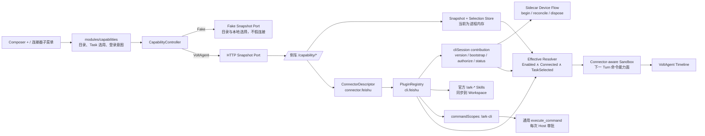
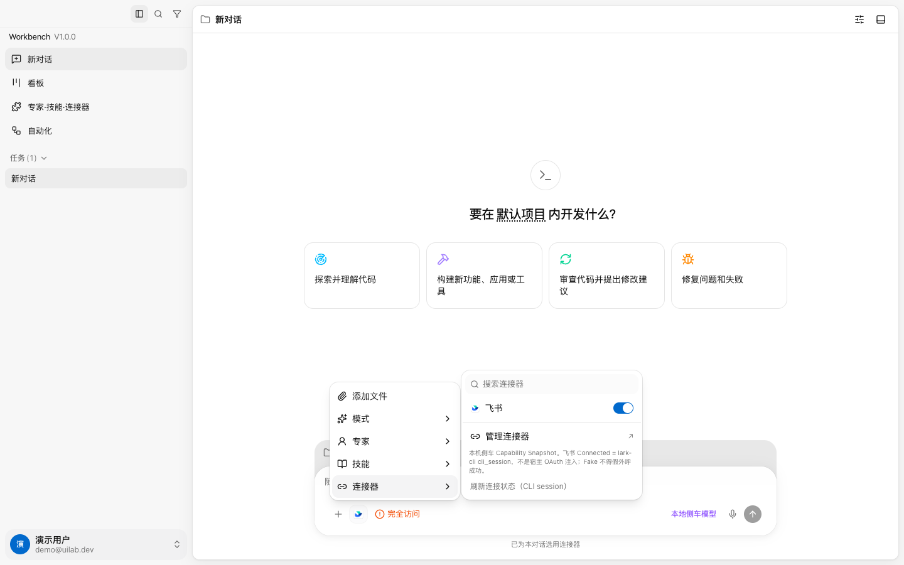
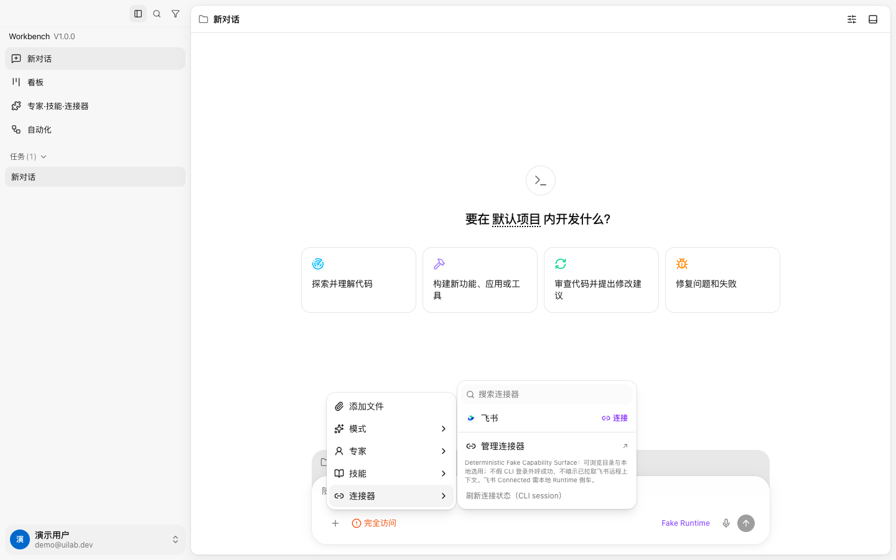

# 飞书 Capability Surface：当前结构与 WorkBuddy 开关映射

**日期：** 2026-08-09
**分支：** `research/capability-surface-reference-models`（工作区）

## 当前产品形态

飞书当前不是一个独立前端插件包。用户看到的是单一产品连接器
`connector.feishu`；它由侧车里的内置能力包 `cli.feishu` 投影出来。
当前验证切片以官方 `lark-cli` 为实现通道，MCP / 宿主 OAuth 只做 Hybrid
预留，没有被包装成第二个「飞书」连接器。




## 代码落点

| 层                    | 位置                                                                                                      | 当前职责                                                  |
| --------------------- | --------------------------------------------------------------------------------------------------------- | --------------------------------------------------------- |
| Composer UI           | `archetypes/agent-workbench/src/modules/capabilities/ui/`                                                 | `+` 菜单、连接器行、芯片、品牌图标                        |
| Workbench Interface   | `archetypes/agent-workbench/src/modules/capabilities/index.ts`                                            | 对其他 Module 的唯一公开入口                              |
| Snapshot / selection  | `archetypes/agent-workbench/src/modules/capabilities/ports/`、`adapters/`、`application/`                 | 浏览器安全读模型、Task 选用、登录/刷新意图                |
| Composition           | `archetypes/agent-workbench/src/app/composition/runtime-wiring.ts`                                        | Fake 与 HTTP Capability Port 装配                         |
| 产品连接器投影        | `tooling/workbench-runtime-voltagent/src/plugin/connector-descriptor.ts`                                  | 单一 `connector.feishu`、通道与命令范围                   |
| Plugin packaging 真相 | `tooling/workbench-runtime-voltagent/src/plugin/builtins.ts`                                              | `cli.feishu` 的 Skills/command scope/Auth 声明             |
| Plugin schema         | `tooling/workbench-runtime-voltagent/src/plugin/manifest.ts`                                              | Connector command scope / trusted installed Skills 合同    |
| Capability HTTP       | `tooling/workbench-runtime-voltagent/src/capability/http-routes.ts`                                       | snapshot、Task selection、startAuth、refresh、active task |
| Effective resolver    | `tooling/workbench-runtime-voltagent/src/plugin/effective-capabilities.ts`                                | 决定下一 Turn 是否出现 `lark-cli` command scope            |
| Shell deep module     | `tooling/workbench-runtime-voltagent/src/runtime-shell/`                                                  | 通用 Shell、Task/Auth gate、Provider credential adapter   |

## `connector.feishu` 当前字段

| 字段            | 当前值                                         |
| --------------- | ---------------------------------------------- |
| 产品 id         | `connector.feishu`                             |
| 显示名          | 飞书                                           |
| Plugin 来源     | `cli.feishu`                                   |
| 主通道          | `domain_cli`                                   |
| 二进制          | 项目固定依赖 `@larksuite/cli@1.0.85`（可用 `FEISHU_CLI_PATH` 覆盖） |
| 首次连接        | `config init --new` → `open.feishu.cn/page/cli` |
| 用户授权        | `auth login --no-wait --json` → 账号授权页；Sidecar 私有恢复轮询 |
| Connected       | `lark-cli auth status --json` 成功，即 `cli_session` |
| 子能力          | 原生 CLI / 官方 Skills                         |
| Runtime 工具    | 仅通用 `execute_command`，无飞书专用 wrapper      |
| 命令范围        | `lark-cli`                                     |
| MCP             | 同一 Connector 下后置 Hybrid；当前不可用       |
| Renderer secret | 无；浏览器只消费 status-safe snapshot          |

## WorkBuddy 交互映射

连接器行明确区分身份连接和本 Task 选用：



| 状态                                 | 右侧控件      | 行为                                                  |
| ------------------------------------ | ------------- | ----------------------------------------------------- |
| `Connected=false`                    | 「连接」CTA   | 一键启动飞书 CLI；首次自动衔接“配置应用 → 授权账号”两步；Fake 诚实提示需本地 Runtime |
| `Connected=true, TaskSelected=false` | 关闭的 Switch | 打开后仅为当前 Task 选用，不改变 CLI 登录态           |
| `Connected=true, TaskSelected=true`  | 打开的 Switch | 关闭后 `lark-cli` 命令能力从下一 Turn 缺席，但不会退出飞书登录 |
| 外部授权失效且仍 TaskSelected        | 「连接」CTA   | 保留选择，重新连接后 Switch 恢复原选中状态            |

因此，Switch 表达的是 `TaskSelected`，不是 `Connected`。最终能力面仍由侧车公式决定：

```text
PluginEnabled ∧ Connected ∧ TaskSelected ∧ !TaskMuted
```

## 图标来源

- 源文件：`/Applications/Lark.app/Contents/Resources/app.icns`
- Bundle id：`com.bytedance.macos.feishu`
- Bundle name：`Feishu`
- 本机版本：`7.47.15`
- 仓库资产：`archetypes/agent-workbench/src/assets/connectors/feishu-app-icon.png`

当前手绘近似 SVG 已移除。仓库使用本地 PNG，不依赖 CDN；模板对外发布前仍需复核品牌与再分发要求。

## 当前未完成边界

- 侧车与 Fake 的 Task capability selection 当前都只存在内存；**页面刷新**已验证可恢复，但侧车进程重启后的持久化尚未交付。
- 飞书 MCP + 宿主 OAuth Hybrid 尚未交付。
- 设置页完整连接器管理 IA 尚未交付；当前主路径仍是 Composer `+`。

## 本轮验证

- `http://localhost:5177/` + `http://127.0.0.1:3141/`，真实侧车、`cli.feishu` Connected。
- Switch 关闭：`TaskSelected=false`、`capabilityEffective=false`、`effectiveCommandScopes=[]`。
- Switch 打开：`TaskSelected=true`、CLI Connected 时 `capabilityEffective=true`，`effectiveCommandScopes=['lark-cli']`。
- 整页 reload 后，当前 Task 的飞书图标与选用状态恢复。
- 修复 Switch/父菜单行双触发后，每次开关仅产生一次 `/capability/selection` POST。
- 浏览器 console：0 error / 0 warning。

无侧车 Fake 路径也完成了独立冒烟：



- 目录和官方图标正常显示，但不出现 Connected / Switch 假绿点。
- 点击「连接」只返回“需本地 Runtime / 不会假外呼”的 `aria-live` 状态。
- 会议纪要专家与默认 skill 可本地选用，文案不暗示已读取飞书远程内容。
