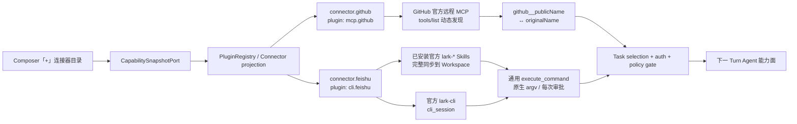

# Evidence：GitHub/MCP + 飞书/CLI 双 Provider 内置连接器

- **Date:** 2026-08-09
- **Decision:** 平台同时支持 MCP 与领域 CLI，但不要求单个 Connector 默认 Hybrid
- **Product catalog:** `connector.github`、`connector.feishu`
- **Architecture:** [ADR 0017](../adr/0017-provider-owned-plugin-contract-and-dynamic-discovery.md)
- **2026-08-10a（已取代）:** Sidecar 自持 App 凭据方案仅作为中间实现记录。
- **2026-08-10b addendum:** GitHub 再收敛为平台 UI Lab Connector 一键授权；普通用户/Sidecar 不配置 App Secret 或 PAT，真实 Broker 部署仍是外部证据缺口。

## 最终形态

产品目录只有两行。下列内部 builtin package 不增加产品 Connector 行：

- `skills.office`：Workspace Skills 包装
- `mcp.docs`、`mcp.calendar`：既有 env-shaped 内部 MCP 配置

## GitHub：官方 MCP，不封装 `gh`

| 合同 | 落地 |
| --- | --- |
| Plugin | `mcp.github`（默认关闭；启用后由用户显式发起 OAuth） |
| Connector | `connector.github`，`primaryChannel=mcp` |
| Remote | `https://api.githubcopilot.com/mcp/`；`MCP_GITHUB_URL` 可覆盖 |
| Auth | `oauth2/managed_broker`；平台持有 GitHub App/callback，Sidecar 持一次性 claim capability；token 只进 Keychain，Renderer 不持 secret |
| Discovery | MCP `tools/list` 为工具 schema 真源 |
| Identity | `github__<originalName>` ↔ `(mcp.github, github, originalName)` |
| Policy | 动态发现后再执行 approval/filter；Host 不复制 GitHub 业务工具定义 |

官方依据：

- [github/github-mcp-server](https://github.com/github/github-mcp-server)
- [GitHub Primer Octicons](https://github.com/primer/octicons)；UI 使用官方 `mark-github-16`

## 飞书：官方 CLI，不叠加 MCP

| 合同 | 落地 |
| --- | --- |
| Plugin | `cli.feishu` |
| Connector | `connector.feishu`，`primaryChannel=domain_cli` |
| Runtime | 官方 `lark-cli` / `@larksuite/cli@1.0.85` pin guidance |
| Auth | `cli_session`；`lark-cli auth status/login` |
| Skills | 已安装的官方 `lark-*` Skill 包（含 references/scripts/assets）同步到 `/.runtime-skills/feishu` |
| Runtime tool | 仅通用 `execute_command`；飞书不再生成 Provider-specific wrapper tool |
| Command scope | `lark-cli`；`PluginEnabled ∧ Connected ∧ TaskSelected` 时生效 |
| Safety | 固定可执行文件、模型 env 不进 Provider 进程、超时/输出上限、间接 shell 绕过拒绝、每次 Host 审批 |

飞书品牌图标继续使用本机 `/Applications/Lark.app` 官方应用资源提取的 PNG；Fake 与
Sidecar 均已移除“飞书 MCP 后置 Hybrid”状态行。

## UI 交互

- Composer「+」→「连接器」横向子菜单中显示 GitHub、飞书两行。
- 未 Connected：右侧显示“连接”；GitHub 打开 OAuth 授权页，飞书启动或提示 `lark-cli` 登录。
- Connected：右侧显示 WorkBuddy 同构 Switch；Switch 仅控制当前 Task 选用。
- GitHub 使用官方 Primer SVG；飞书使用官方应用 PNG；未知外部 Connector 才回退首字母。
- 2026-08-09 headless 目视检查：两行、两个品牌标识可见；console 0 error/warning。

## 自动化证据

| Gate | Result |
| --- | --- |
| GitHub Broker session + claim + bearer injection + dynamic tool + reversible identity | PASS（fake Broker + mock MCP host） |
| GitHub Task-selected effective tool scope | PASS（`github__search_repositories`） |
| GitHub / 飞书 startAuth 分流 | PASS（oauth2 browser flow / cli_session device flow） |
| Fake 目录与诚实提示 | PASS |
| Workbench tests | **316 / 316 PASS** |
| Sidecar full tests | **PASS，exit 0** |
| Sidecar + Workbench typecheck | PASS |
| Workbench production build | PASS（仅既有 chunk-size warning） |
| `check:workbench` / `check:foundation` / `check:ai` | PASS |
| GitHub live smoke harness | PASS（无凭据 preflight：无网络、退出码 2；mock dynamic path：PASS） |
| 飞书官方 Skills + Shell 装配 | PASS（真实本机：`lark-cli 1.0.67`、28 个官方 `lark-*` Skills、`lark-doc`、`execute_command`、固定 argv、Task/Auth gate） |
| 飞书真实 Registry 装配 | PASS（无飞书 wrapper tools；`commandScopes=['lark-cli']`；`auth cli:feishu=connected`） |
| 飞书真实模型路径 | **PASS**（`deepseek-v4-flash`：读取官方 `lark-doc` / `lark-shared` / `lark-doc-fetch` → 精确 `execute_command` argv → Host approval → 成功 result） |
| 黄金探针防误判 | PASS（忽略 start-step 中的 prompt/system/tool schema 回显；只认预期工具成功 result；独立 Node test） |
| Sidecar HTTP 黄金路径 | **12 / 12 PASS**（隔离 :3143 + 临时 Workspace；真实文档 G.5 stream 命中精确 argv 并正确停在 Host approval） |
| Sidecar full tests | **267 / 267 PASS** |
| Playwright 真实侧车 UI | **PASS**（飞书 WorkBuddy 同构 Switch → 真实 Turn →「允许一次」→ `lark-cli docs +fetch` 成功；console 0 error/warning） |

说明：该次 doctor 整体退出码为 1，因为同一进程中的可选 `mcp.docs` / `mcp.calendar`
未配置；飞书两条 finding 均为 `ok`，不把可选 MCP 的缺省状态误记为飞书失败。

黄金脚本只认结构化 `execute_command` 事件和精确 `command/args`；成功 result 或正确的 Host approval pause 才计入，prompt/schema 回显不计入。

## G.5 真实文档读取证据

- 文档：`https://larkcommunity.feishu.cn/docx/OaRIdFIRFoLM3xxTmKwcetHqn5e`
- 模型：`deepseek-v4-flash`
- Runtime：Office Profile，`cli.feishu`，隔离 Sidecar `:3143` + 临时 Workspace
- Agent 行为：先读取 `lark-doc`、`lark-shared`、`lark-doc-fetch`，再请求通用 `execute_command`
- 原生 argv：`lark-cli docs +fetch --doc <URL> --doc-format markdown`
- 审批：UI 显示「请求执行 lark-cli」；点击「允许一次」后恢复同一 Run
- 结果：`success=true`、`exit_code=0`、`duration_ms=917`；飞书 envelope 为 `ok=true`、`identity=user`、`revision_id=126`
- 内容核验：标题为《把 Claude Code 和 Codex 接入飞书：Lark Coding Agent Bridge》
- 截图：`output/playwright/feishu-g5-approval-request.png`、`output/playwright/feishu-g5-success.png`

## 尚未声称完成

- 尚未部署平台 UI Lab Connector 的真实 GitHub App、Broker HTTPS 域名与 hosted callback，因此未做真实账号 OAuth。fake Broker session/claim、Keychain binding 与 MCP 热加载已通过。
- GitHub builtin 的 PAT 与本机 Client Secret 路径已删除；不会把平台部署缺口转嫁给普通用户。
- 外部 Plugin 的任意品牌资产分发合同尚未实现；本轮只完成两个 builtin Connector 的官方标识。
