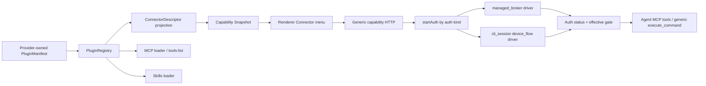

# Agent Workbench Plugin / Connector 授权机制架构评审

## 评审结论

- Outcome: Experiment-ready
- Architecture decision: adopt candidate
- Confidence: Medium
- Scope / excluded scope: [D] 范围是本地 Workbench Renderer、VoltAgent Sidecar、PluginRegistry、两个产品级内置 Connector（GitHub MCP、飞书 CLI）及授权接缝。排除生产 Connector Broker、真实 GitHub App、完整真实飞书账号授权、云上多租户、Marketplace 和第三方受信代码包安装；这些仍是 [U] 外部验收项。

## 范围与证据

| ID | Level [D/I/U] | Evidence | Claim / limitation |
| --- | --- | --- | --- |
| D1 | [D] | `src/plugin/manifest.ts`、`registry.ts`、`discover.ts` | Plugin 以 manifest 注册 connectors / MCP / CLI / Skills / auth；外部 JSON 只允许声明式贡献。 |
| D2 | [D] | `src/plugin/builtins.ts` | GitHub 与飞书的产品 metadata、通道、认证合同和 Provider 参数均在 builtin manifest，不在 HTTP/Renderer kernel。 |
| D3 | [D] | `connector-oauth.ts`、`connector-cli-auth.ts` | OAuth Broker 与 CLI Device Flow 是两个 auth-kind driver；driver 从 manifest 解析 Provider 参数。 |
| D4 | [D] | `start-auth.ts`、`http-routes.ts`、`server.ts` | HTTP 授权入口只按 auth kind 分派，不导入飞书/GitHub常量，也不执行 Provider 命令。 |
| D5 | [D] | `capability-snapshot-port.ts`、HTTP adapter、`wait-for-connector-auth.ts` | Renderer 只消费 URL、step、transition 和状态；没有 `deviceCode`、token 或 App Secret 字段。 |
| D6 | [D] | `package.json`、`pnpm-lock.yaml`、本地 `pnpm exec lark-cli --version` | Sidecar 固定依赖并实际解析到 `@larksuite/cli@1.0.85`。 |
| D7 | [D] | `lark-cli auth status --json` 本地只读结果 | 当前机器返回 `config/not_configured`，会进入首次 bootstrap 分支；尚未替用户完成外部授权。 |
| D8 | [D] | Sidecar / Workbench tests、typecheck | 通用 CLI 两步状态机、HTTP continuation、无 device code、GitHub fake Broker hot-load 和前端轮询均有回归。 |
| U1 | [U] | 未配置生产 `UILAB_CONNECTOR_BROKER_URL` | GitHub 一键授权只有代码与 fake Broker 合同证据，无真实平台 Broker/账号 E2E。 |
| U2 | [U] | 未点击真实飞书“授权”完成全链路 | 尚无真实 `config init → auth login → auth status connected → Skill 调用` trace。 |

### 当前结构图与代码位置

> 当前“两个内置插件”是两个逻辑 `PluginManifest`，暂时集中在一个 TS 文件中，并不是两个独立插件目录。

```text
uilab-admin/
├─ tooling/workbench-runtime-voltagent/
│  ├─ package.json                         # 固定 @larksuite/cli@1.0.85
│  └─ src/
│     ├─ plugin/
│     │  ├─ manifest.ts                    # 通用 Plugin / Connector / Auth schema
│     │  ├─ builtins.ts                    # 内置 mcp.github + cli.feishu 真相
│     │  ├─ registry.ts                    # discover / enable / load / refresh
│     │  ├─ connector-descriptor.ts        # manifest → 产品 Connector 投影
│     │  ├─ mcp-loader.ts                  # MCP 动态 tools/list
│     │  ├─ skills-loader.ts               # Skill 同步 / 挂载
│     │  └─ security-policy.ts             # env、审批、secret fail-closed
│     ├─ capability/
│     │  ├─ connector-oauth.ts             # 通用 managed Broker driver
│     │  ├─ connector-cli-auth.ts          # 通用 CLI Device Flow driver
│     │  ├─ start-auth.ts                  # 仅按 auth kind 分派
│     │  ├─ http-routes.ts                 # browser-safe API
│     │  └─ snapshot.ts                    # status-safe Connector read model
│     └─ runtime-shell/                     # 通用 execute_command + Task/Auth gate
└─ archetypes/agent-workbench/src/
   ├─ assets/connectors/feishu-app-icon.png # 本机官方飞书应用图标资产
   └─ modules/capabilities/
      ├─ ports/                             # Renderer 安全接口
      ├─ adapters/                          # Fake / HTTP
      ├─ application/                       # controller + auth polling
      └─ ui/                                # WorkBuddy 形态、Switch、品牌图标
```



### 两个产品级内置插件

| 产品 Connector | 逻辑 Plugin | 当前物理位置 | 实现通道 | 授权所有者 |
| --- | --- | --- | --- | --- |
| `connector.github` | `BUILTIN_MCP_GITHUB_PLUGIN` / `mcp.github` | `tooling/workbench-runtime-voltagent/src/plugin/builtins.ts` | GitHub 官方远程 MCP，`tools/list` 动态发现 | 平台 Connector Broker 持 GitHub App；Sidecar 持短期 claim 与 Keychain token；Renderer 只持 URL/状态 |
| `connector.feishu` | `BUILTIN_CLI_FEISHU_PLUGIN` / `cli.feishu` | 同上；CLI 依赖在 Sidecar `package.json` | 官方 `lark-*` Skills + 通用 Shell 执行原生 `lark-cli` | 官方 CLI 自己保存 App/用户凭据；Sidecar 只编排状态机并私有持有临时 device code |

`mcp.docs`、`mcp.calendar`、`skills.office` 也是 Registry builtin，但当前没有投影为这次产品菜单里的独立 Connector；不能和上述两个产品级 Connector 混为一谈。

## 问题契约

[D] 目标是同时支持“GitHub 走 MCP”和“飞书走官方 CLI”，普通用户都从一个「连接」按钮开始；Host 不重写飞书业务命令、不要求用户创建 GitHub App/PAT、不让 Provider secret 穿过 Renderer。

[D] 代表性负载：

1. Registry 启动并投影两个 Connector。
2. 未连接用户点击「连接」。
3. GitHub：Sidecar 创建平台 Broker session，浏览器完成 OAuth，Sidecar claim 并热加载 MCP tools。
4. 飞书首次：Sidecar 启动 Provider 声明的 bootstrap，浏览器打开 `open.feishu.cn/page/cli`；完成后 Sidecar 启动用户授权并把同一窗口切到账号授权页；CLI 保存 token，`auth status --json` 才使 Connector 变为 Connected。
5. 用户打开 WorkBuddy 风格 Switch，只为当前 Task 选用 Connector；最终能力公式为 `PluginEnabled ∧ Connected ∧ TaskSelected ∧ !TaskMuted`。

[D] 输入是 Connector id、可选 CLI domain、平台发行配置和用户在 Provider 页面的决定。输出是 browser-safe URL/transition、Connector 状态、动态 MCP tools 或 CLI command scope。副作用是 Keychain/CLI 自有配置与 token、MCP 连接、Agent 后续命令执行；实际工具执行仍需 Host 审批。

[D] 验收门：Host kernel 无 Provider 命令/ID分支；首次飞书两步可续接；Renderer 无 secret/device code；外部 JSON 不能声明受信 auth executable/Broker；最低 CLI 版本固定；Sidecar 与 Workbench 回归通过。基线失败是旧 HTTP 模块直接拼 `lark-cli auth login`：它不会处理 `not_configured`，不会恢复 `device_code`，且把飞书语义与 device code 暴露到通用接口。

## 双轴诊断

- C1 Perception: [D] N/A；授权是确定性协议，不读取模型上下文。
- C2 Memory: [D] 适用。OAuth pending 与 CLI device code 当前在 Sidecar 内存；token 分别进入 Keychain/官方 CLI 存储。[U] Sidecar 重启时 pending flow 不恢复。
- C3 Reasoning: [D] N/A；不使用模型决定授权步骤。
- C4 Action: [D] 核心。manifest → begin → browser → reconcile → status → capability gate 是有序动作链。
- C5 Reflection: [D] N/A；没有 Agent 自我反思。
- C6 Collaboration: [D] N/A；Renderer/Sidecar/Broker/Provider 是组件边界，不是多 Agent 协作。
- C7 Governance: [D] 核心。Provider、Host、平台 Broker 与 Renderer 的凭据/命令所有权明确；外部插件权限受限。
- T1 Chain: [D] 主拓扑；授权步骤存在严格依赖。
- T5 Loop: [D] 仅用于有界 polling，受 timeout/expiry/maxAttempts 终止。
- T2/T3/T4/T6: [D] 不需要路由、并行、多 Agent 编排或 Agent 层级；增加它们不会改善此负载。

## 硬门槛

| Gate | Status (PASS/FAIL/UNKNOWN/N/A) | Evidence | Remediation |
| --- | --- | --- | --- |
| 目标、输出、负载 | PASS | [D] 两种通道与统一连接入口已编码并有同负载测试。 | 真实账号复跑同一流程。 |
| 权限与高风险副作用 | PASS | [D] Renderer 无 secret；外部 JSON 禁止 managed Broker/CLI executable auth；Shell 始终审批。 | 上线前复核 Provider scope。 |
| 预算与终止 | PASS | [D] CLI/HTTP timeout、URL 等待、授权 expiry 和前端 maxAttempts 明确。 | 增加 timeout 指标。 |
| 幂等与恢复 | UNKNOWN | [U] pending OAuth/CLI session 仅内存，Sidecar 重启会要求重连。 | 明确重连 UX，或设计非密可恢复 session。 |
| 隐私、租户与不可信上下文 | UNKNOWN | [D] 本地 seam 已隔离；[U] 生产 Broker 租户绑定、防重放和审计未验证。 | 完成 Broker 威胁模型与 A/B 租户测试。 |
| 可观测与版本 | UNKNOWN | [D] manifest schema 和 CLI 版本固定；[U] 无生产 auth trace/SLO/support id。 | 增加脱敏 session lifecycle trace。 |
| 评价与回归 | PASS | [D] TDD red/green、Sidecar/Workbench 全量测试与 typecheck。 | 增加真实 GitHub/飞书 E2E 发布门。 |
| 人工升级/降级 | PASS | [D] 用户可拒绝/关闭页面；失败保持 Disconnected；插件可禁用；无 PAT fallback。 | 增加取消/超时后的明确 CTA。 |

## 最小基线

[D] 最小基线是 2026-08-10 修复前实现：`capability/start-auth.ts` 导入飞书常量并直接执行 `auth login --no-wait --json`，HTTP 路由导入飞书 ID 并单独 probe，Renderer 暴露 `deviceCode`，只为 OAuth 启动轮询。

- Baseline result: FAIL
- [D] 失败门：本机 `auth status --json` 返回 `config/not_configured`；旧路径没有 `config init --new`，因此打开的账号授权页不能代表完整当前连接；完成授权后也没有 `--device-code` continuation。
- [D] TDD 原始证据：通用 demo Connector 的 bootstrap/continuation tests 在实现 driver 前失败，完整候选后通过。

## 候选模式

[D] 采用候选：Provider-declared Auth Driver。坐标为 C4 Action + C7 Governance，拓扑为 T1 Chain + 有界 T5 Loop。

- 解决失败：Provider 命令、最低版本、首次配置条件、URL host 与 env 白名单进入受信 manifest；Host 只持统一状态机。
- 前提：[D] Provider CLI 能输出结构化状态/URL/device flow；managed OAuth 有平台 Broker contract。
- 成本/风险：[I] manifest auth schema 更深；长进程生命周期、重启恢复和 URL 安全需要持续治理。
- 反证信号：[U] Provider 升级后必须修改 Host core；新 CLI Device Flow 不能只通过新 builtin manifest 接入；device code 出现在 HTTP/Renderer；真实两步流程无法续接。
- 拒绝替代：为每个 Provider 写 HTTP 分支；把飞书 CLI 再包装成 Host tools；让外部 JSON 任意声明授权命令；把飞书强制改成 MCP。

## 接缝与工件

| Artifact / seam | Producer | Consumer | Owner / write rule | Version / failure / authorization |
| --- | --- | --- | --- | --- |
| `PluginManifest` | builtin Provider / local JSON | Registry | Provider metadata；Host 校验 | schema v1；冲突 fail-closed |
| `ConnectorDescriptor` | generic projection | Snapshot / UI / gate | Host 只投影，不补 Provider 业务语义 | duplicate Connector id 当前拒绝 |
| `OAuthContribution` | builtin Provider | managed Broker driver | Provider 声明 provider/server/Broker ref | 缺 Broker fail-closed；外部 JSON 禁止 managed strategy |
| `CliSessionContribution` | builtin Provider | CLI auth driver / Shell env | Provider 声明 version/argv/hosts/env | 外部 JSON 禁止；命令 `shell:false` |
| `device_code` | Provider CLI | Sidecar CLI session map | 仅 Sidecar 内存读写 | 过期/失败删除；不进入 HTTP |
| auth transition | Sidecar HTTP | Renderer poller | 只含 connector/kind/phase/step/URL/message | URL 必须是 Provider allowlist HTTPS host |
| Auth status | Provider probe / Registry | Snapshot/effective resolver | status-safe；不含 secret | Connected 才可进入下一 Turn |
| MCP tool identity | Provider `tools/list` | Agent Registry | originalName 为真源，Host 可逆前缀 | 默认审批；热加载失败不宣称 Connected |
| CLI command scope | Provider manifest | connector-aware Workspace Shell | 固定 executable；模型 env 丢弃 | Plugin/Auth/Task 三门 + 用户审批 |

### 通用性审计

| 位置/行为 | 判断 | 当前状态 |
| --- | --- | --- |
| `start-auth.ts`、`http-routes.ts`、`server.ts` | Host kernel 不应知道 Provider | [D] 已修复：无 GitHub/飞书 ID、命令或资源常量分支。 |
| CLI auth 与 Workspace Shell child env | 不应写死飞书 env | [D] 已修复：由 `cliSession.childEnvKeys` 声明并经通用 policy 过滤。 |
| OAuth 错误/成功文案 | 不应写死 GitHub | [D] 已修复：由 descriptor name 与 manifest env refs 生成。 |
| Snapshot honesty | 不应有 `feishuAuthModel` | [D] 已修复为 `authBoundary=provider_declared`。 |
| `builtins.ts` 中 Provider URL、argv、名称、scope | 合理的 Provider-owned 差异 | [D] 保留；这正是插件边界，不属于 Host 耦合。 |
| `brand-icons.tsx` / `capability-add-menu.tsx` 按两个 Connector id 选品牌图标 | 非通用 UI 扩展点 | [D] 仍存在；未知 Connector 可显示首字 fallback，但新增正式品牌图标要改 Renderer。 |
| Fake adapter 手写 GitHub/飞书目录 | 非通用 Fake catalog | [D] 仍存在；真实 Sidecar 动态投影不受影响，但新增 Connector 的 Fake 展示需改代码。 |
| 两个 builtin 集中在单个 `builtins.ts` | 包装层尚未物理插件化 | [D] 仍存在；逻辑边界成立，独立目录/资产/版本发布尚未完成。 |
| 外部 JSON 不能声明 `cliSession` / `managed_broker` | 有意的安全限制，不是遗漏 | [D] 外部声明式插件不能执行 auth 命令或冒充平台身份；未来需“签名/受信代码包”后才能开放。 |
| duplicate Connector id | 泛化规则未定义 | [D] 当前 fail-closed；同一产品多 Provider 聚合仍需新 ADR。 |
| CLI 官方配置使用用户的默认 lark-cli 配置空间 | Provider-native 兼容优先，但可能共享状态 | [I] 当前保证官方 Skills 直接可用；若产品要求应用隔离，应新增 manifest-declared profile/state-dir，而不是在 Host 写飞书分支。 |

## 验证计划与结果

- [D] Baseline result: FAIL — `not_configured` 不能由旧单步 login 路径恢复。
- [D] Full candidate result: PASS（模拟同负载）— bootstrap URL → authorization URL → Sidecar 私有 device code polling → status Connected；HTTP/Renderer 仅看到安全 transition。
- [D] Ablation result: DEGRADED — 不提供 `cliSession` contribution 时通用 startAuth 返回 CLI runtime unavailable；外部 JSON 声明该能力被拒；不 reconcile 时不会产生第二步授权 URL。
- [D] Sidecar typecheck 通过；CLI auth/startAuth/HTTP 定向测试通过；本地 `lark-cli` 版本与结构化 `not_configured` 探测通过。
- [D] Workbench typecheck 与浏览器测试通过，包含 auth continuation poller 和 WorkBuddy Connector UI。
- [U] 未完成：真实飞书扫码/授权到 Connected；真实 GitHub Broker/账号/MCP；Sidecar 重启中的 pending flow；生产 trace。

## 健康扫描

| Dimension | Relevance | Maturity | Evidence / risk |
| --- | --- | ---: | --- |
| C1 Perception | N/A（无模型上下文） | — | [D] 确定性协议。 |
| C2 Memory | Required | 2 | [D] token 存储边界明确；[U] pending flow 重启恢复缺失。 |
| C3 Reasoning | N/A（无模型推理） | — | [D] 状态/manifest 驱动。 |
| C4 Action | Required | 3 | [D] 两类 driver、HTTP continuation、status gate 有测试。 |
| C5 Reflection | N/A（无反思） | — | [D] 不需要。 |
| C6 Collaboration | N/A（无多 Agent） | — | [D] 组件协作不等于 Agent 拓扑。 |
| C7 Governance | Required | 2 | [D] 本地所有权清晰；[U] Broker 生产治理未验证。 |
| Topology Fit | Required | 3 | [D] 顺序链 + 有界轮询与依赖一致。 |
| Composition Seams | Required | 3 | [D] manifest/descriptor/status/transition/command scope 有唯一所有者。 |
| Generality | Required | 2 | [D] auth kernel 已 Provider-neutral；品牌图标、Fake catalog、物理 builtin 包仍需扩展点。 |
| Verification Maturity | Required | 2 | [D] fake/进程/浏览器回归；[U] 两个真实 Provider E2E 未完成。 |

## 优化路线

1. [U] 先做真实飞书手工 UAT：首次配置页、账号授权页、Connected、读取指定文档、Task Switch 开/关；这是当前最短验收路径。
2. [U] 部署真实 GitHub Connector Broker，执行 callback/claim/refresh/remote MCP E2E；未部署前 GitHub 只应显示平台服务未配置。
3. [I] 把 `builtins.ts` 拆成 `plugins/github-mcp/` 与 `plugins/feishu-cli/` 包，资产、manifest、测试和版本各自拥有；Registry 接口不变。
4. [I] 给 Connector contribution 增加安全的 icon asset key/registry，删除 Renderer 对两个 id 的品牌分支；Fake catalog 改为从共享无副作用 manifest fixture 投影。
5. [U] 若需要隔离本机其他 Agent 的飞书 CLI 状态，新增通用 manifest-declared profile/state-directory seam，并验证官方 Skills 子进程继承同一环境。
6. [U] 定义同 Connector 多 Provider contribution 的聚合、优先级、状态和冲突规则；继续维持当前 fail-closed 直到 ADR 完成。

## 回退与重开

[D] 回退：用 `PLUGINS_DISABLED=cli.feishu` 或不配置 GitHub Broker 禁用相应 Connector；用户看到 Disconnected/不可用，其他插件与本地任务不受影响。代码回退时应同时移除 manifest `cliSession` 与 UI continuation，不能恢复 Renderer `deviceCode` 或 HTTP 飞书特例。负责人是 Workbench Runtime/Connector owner。

[U] 重开条件：官方 CLI 改变 `config init/auth login --no-wait/--device-code` 合同；CLI 1.0.85 不再兼容；Provider URL host 变化；真实 E2E 无法在同一窗口续接；Broker 无法满足租户隔离；产品要求第三方插件自行提供可执行 auth driver；同一 Connector 需要多 Provider 聚合。

## 证据索引

- [D] `tooling/workbench-runtime-voltagent/src/plugin/manifest.ts`
- [D] `tooling/workbench-runtime-voltagent/src/plugin/builtins.ts`
- [D] `tooling/workbench-runtime-voltagent/src/plugin/registry.ts`
- [D] `tooling/workbench-runtime-voltagent/src/plugin/discover.ts`
- [D] `tooling/workbench-runtime-voltagent/src/capability/connector-cli-auth.ts`
- [D] `tooling/workbench-runtime-voltagent/src/capability/connector-oauth.ts`
- [D] `tooling/workbench-runtime-voltagent/src/capability/start-auth.ts`
- [D] `tooling/workbench-runtime-voltagent/src/capability/http-routes.ts`
- [D] `tooling/workbench-runtime-voltagent/src/create-agent.ts`
- [D] `archetypes/agent-workbench/src/modules/capabilities/ports/capability-snapshot-port.ts`
- [D] `archetypes/agent-workbench/src/modules/capabilities/application/wait-for-connector-auth.ts`
- [D] `archetypes/agent-workbench/src/modules/task/ui/composer/composer.tsx`
- [D] `docs/adr/0017-provider-owned-plugin-contract-and-dynamic-discovery.md`
- [D] `docs/evidence/github-managed-connector-oauth-architecture-review-2026-08-10.md`
- [U] 生产 GitHub Broker、真实飞书/GitHub账号 E2E、租户 trace。
